# Sample AspNetCore Web App with Azure Maps and Azure AD B2C

This sample targets applications which require consumer account sign-in for necessary business functionality. With Azure B2C an application can migrate existing user management systems or develop a new user management system which enables application branding and functionality to enable all public identity providers which support OpenID Connect.

Benefits to choosing an implementation based on Azure AD B2C:

- Pre-built feature for user name, email, password account management.
- Single system for multiple identity provider integrations.
- Pay per usage of Azure AD B2C.
- Granular application authorization from OAuth2 scopes.
- Compliant and securely managed credentials for users
- Customizable or Advanced authentication for application sign-in.

To learn more on benefits, see [Azure AD B2C](https://azure.microsoft.com/services/active-directory/external-identities/b2c/).

> ![NOTE]
> Azure AD B2C can be leveraged for sign-in experiences on mobile platforms too.

This sample shows how a Web application based on AspNetCore can be configured to enabled with Azure AD B2C sign-in and grant the application access on behalf of users to Azure Maps REST APIs to render the Azure Maps JS Map Control.

## How to configure B2C Directory

1. Create a new Web App Asp.Net Core from Visual Studio template.
2. Create an [Azure AD B2C tenant](https://docs.microsoft.com/azure/active-directory-b2c/tutorial-create-tenant)

      - Once the tenant is created you will need to switch directories in Azure Portal to configure applications and policies in the Azure AD B2C tenant.

3. While in the Azure AD B2C directory, [Create new application registration](https://docs.microsoft.com/azure/active-directory-b2c/tutorial-register-applications?tabs=applications) which will represent the AspNetCore Web application users will sign-in to.

   1. Provision Azure Maps Service principal in B2C tenant, you must be Azure AD B2C tenant administrator. You will require the Azure Powershell modules, to learn how to install see, [Install Azure Powershell](https://docs.microsoft.com/powershell/azure/install-az-ps?view=azps-4.2.0)

      ```powershell
         New-AzureADServicePrincipal -AppId ba1ea022-5807-41d5-bbeb-292c7e1cf5f6 -DisplayName "Azure Maps"
      ```

   2. Create the application registration with a display name and select the supported account type: `Accounts in any organization or any identity provider`, specify redirect uri for local debugging as `https://localhost:5001/signin-oidc`

      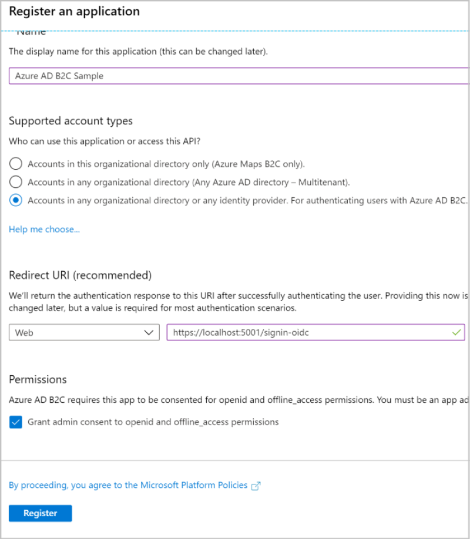

   3. Once created, go to Authentication and ensure Implicit grant `ID Tokens` and `Access Tokens` are enabled.

      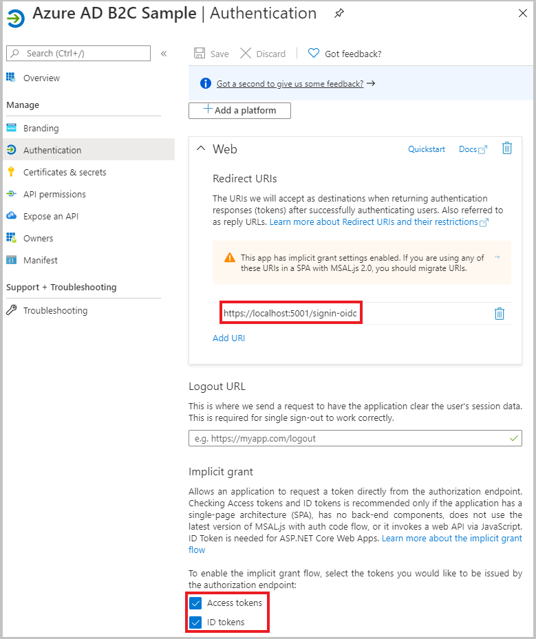

   4. Go to Certificates & Secrets to create an application secret to use to authenticate to Azure AD B2C as part of the requirement for the application to request an access_token on behalf of the user to Azure Maps REST APIs.

      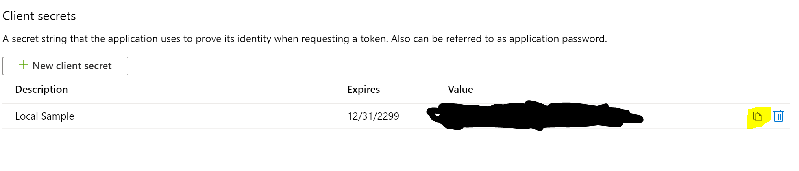

      - Copy this secret as you will need to store it into an Azure Key Vault for the application to authenticate to Azure AD B2C.

   5. Go to API permissions and add permission to Azure Maps. Select the required scopes based on which Azure Maps REST API is required. Currently, only `user_impersonation` is supported. In the future we may provide more fine grained scopes.

      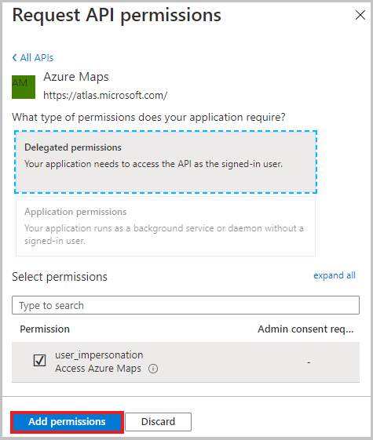

   6. Copy the App ID also known as a "ClientID" from the overview page and use it for configuration of the Web Application.

4. Configure Identity Providers,  [Create an Identity provider such as Google](https://docs.microsoft.com/azure/active-directory-b2c/identity-provider-google). You may also want additional providers such as local accounts, Apple, Microsoft, Facebook, Amazon, or others.

      1. Navigate to Identity Providers in the B2C tenant and add Google. You will need to complete the following fields with an application from Google.

         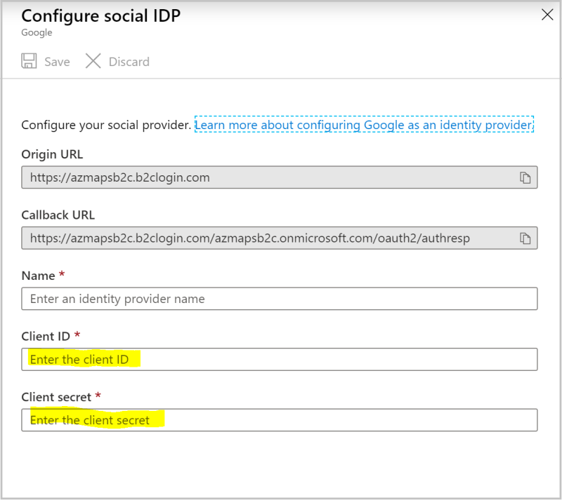

      2. With a new browser window, create a project and in Google Developer Console.

      3. Navigate to `Credentials` and create a new OAuth2.0 Client ID. You must take the new client id, client secret, and put those values in the respective fields for step 1.

      4. While still on the Google Client ID page, add in the origin for the Azure AD B2C directory, and add the redirect url with the format of `https://<azuread-b2c>.b2clogin.com/<tenant-id>/oauth2/authresp`, Note that tenant id is used in this sample application, but can be replaced with named identifier.

         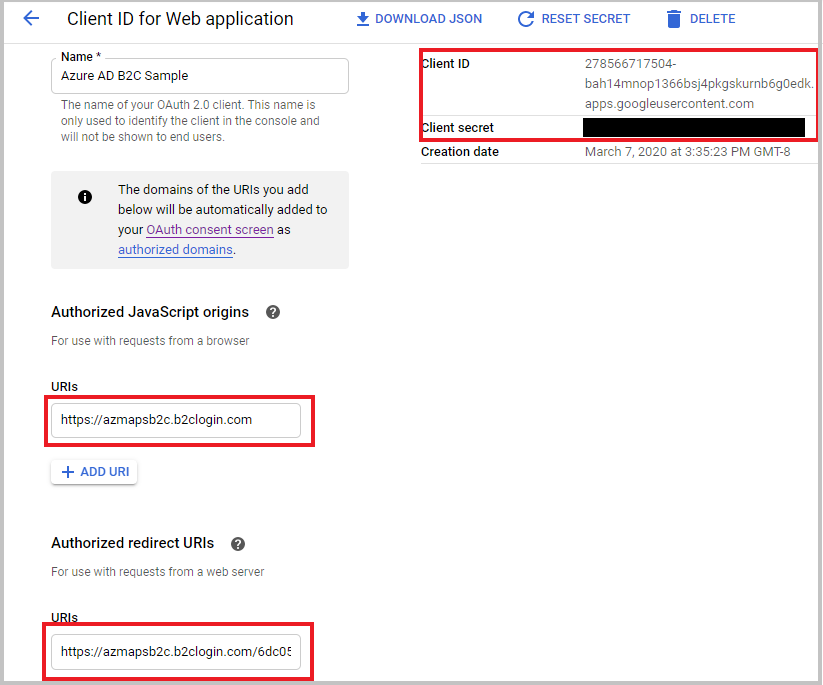

      5. Navigate to the OAuth Consent screen, create a new application which is user type: External.

         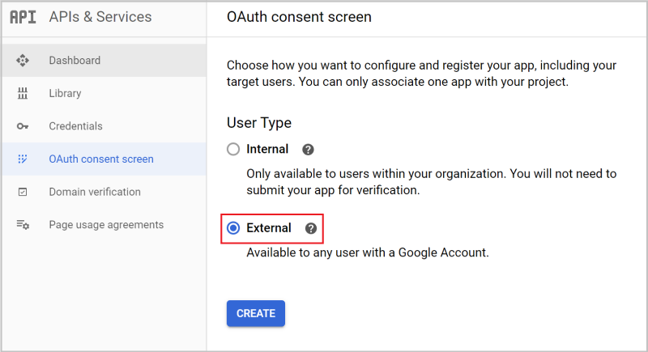

      6. Configure the OAuth Consent to include the `openid`, `name`, and `email` scopes, then add the authorized domains for `localhost`, and `b2clogin.com`

         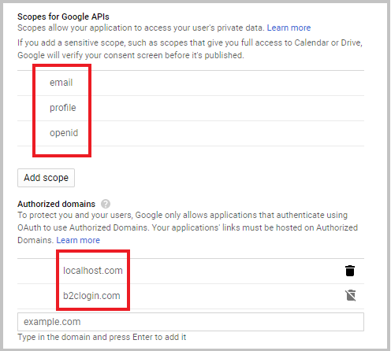

5. Navigate User Flows, and configure a sign-up sign-in user flow.

   1. Name your policy and store it for later so it can be configured with the application sign-in and Azure Maps. Select the Identity Providers you want to use.

      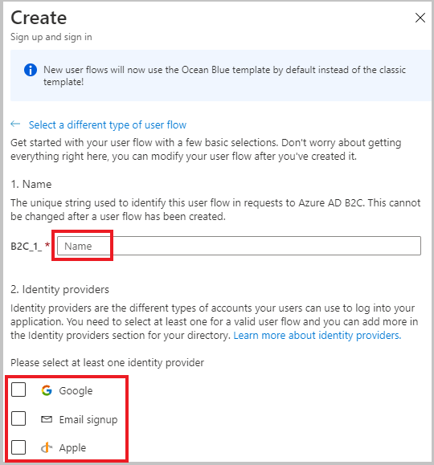

   2. Azure Maps requires the Object ID to be returned in tokens. Select User's Object ID as a return claim from the Show More link.

      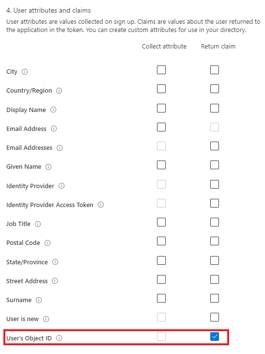

## Create Azure Resources

Now that the Azure AD B2C directory is configured, you must switch back to the Azure AD directory which holds the Azure Subscription. In the Azure Subscription, you should create an Azure Maps account and Azure Key Vault to store the earlier Azure AD B2C Web application secret.

### Create an Application Registration in Azure AD for your Development Environment

   Why: Since this sample requires runtime secrets, the application must be granted access to Azure Key Vault. This is an opinionated step, configuration and setup to access Azure Key Vault using [Azure Service Authentication Library C#](https://docs.microsoft.com/azure/key-vault/service-to-service-authentication). This can can be implemented in other ways, but our recommendation is keep credentials out of code and source control.

   1. Create application registration similar to above but name it specific for Development Environment. You do not need to provide a redirect Uri.
   2. Create a secret string, capture the [application (client) id and the tenant](https://docs.microsoft.com/azure/active-directory/develop/app-registrations-training-guide#new-ui). The application id should be a `guid` and it represents the app in Azure AD. The tenant should be in the form of `mytenant.onmicrosoft.com`. With all these values you can create a connection string `RunAs=App;AppId=[application id];TenantId=[mytenant.onmicrosoft.com];AppKey=[secret string]`
   3. Create an Windows / System environment variable named `AzureServicesAuthConnectionString` with the connection string created above.

### Create an Azure Maps Account resource

Why: we need Azure Maps account resource to authorize with.

   1. Refer to the Azure Maps Resource created in the Parent `README.md`.
   2. Once the resource has been created, go to the authentication blade and copy the [client id property](https://docs.microsoft.com/azure/azure-maps/how-to-manage-authentication#view-authentication-details).
   3. Configure Azure Maps account to authorize Azure AD B2C.
      1. Enable Microsoft Identity Platform (V2.0) wth B2C support, and disable SharedKeys.

         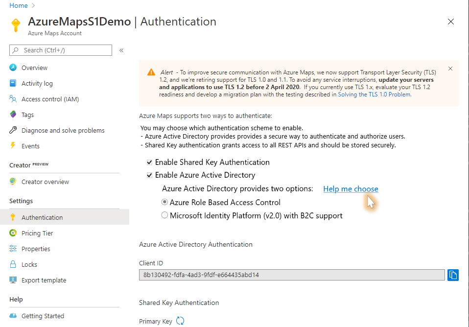

      2. Add the B2C Policy Name, Directory Name, B2C Web Application App ID, to the Map account.  

         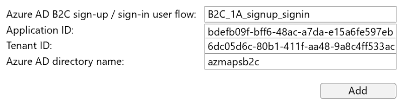

   4. This Azure Maps client id `guid` should be used in `Maps/Index.cshtml` page to indicate the Map account to be used by your application.

### Create Azure Key Vault and store secrets

Why: To store the secret required for the application to acquire an access token once the authorization code has been redeemed. We will use a Key Vault to securely store the string and add the access policy for development environment to securely access the key vault.

   1. There are a few ways to create an Azure Key Vault, the easiest is likely going to the [Azure Portal](https://portal.azure.com/) and searching for Key Vault resource and following the UI. However for production based implementation we suggest you create an Azure Resource Management template to provide a repeatable deployment.
   2. Once the Key Vault has been created, we must take the secret from the Web Application and [set the secret in the Key Vault](https://docs.microsoft.com/azure/key-vault/quick-create-portal).
   3. Take the secret id from the portal and update `AzureAdOptions.cs` in `InitializeAsync()`
   4. Now we must added the Development Environment principal to access the secret, go to the "access policies" blade, and add an access policy with secret permission `get`. Select principal, and search for the display name of your Development Environment application.
   5. Save the access policy, this will grant the application access to read the secret.

### Update AzureAdOptions.cs

The primary configuration of this sample is located in `AzureAdOptions.cs`. You must update the following configuration to reflect the Azure AD B2C tenant configuration.

- Instance
- Authority
- ClientID
- TenantID

   ```csharp
      public string Authority
      {
         get
         {
            return $"{Instance}tfp/{TenantId}/B2C_1A_<your-signup-sign-policy>";
         }
      }

      public async Task InitializeAsync()
      {
         Instance = "https://<your-directory>.b2clogin.com/";
         ClientId = "<your-b2c-web-app-id>";
         TenantId = "<your-b2c-tenant-id>";

         var secret = await keyVaultClient.GetSecretAsync("https://<your-key-vault>.vault.azure.net/secrets/<your-secret-id>/");

         // omitted below code
      }
   ```

### Creating a web application

Why: we need to host the web application.

1. When using Azure AD, it is **critical** to secure your application with an SSL certificate. Visual Studio tools provide AspNetCore applications with a developer SSL certificate which you must trust when prompted during development / debugging of the application.
2. We've added a partial view _LoginPartial.cshtml for Sign-in and Sign-out.
3. The in AspNetCore 2.2, `microsoft.aspnetcore.authentication.openidconnect` Nuget package simplifies the boilerplate code necessary hook up the flow. However we have added some additional opinionated support.
   1. Adding `AzureAdOptions.cs` will enable the settings and secrets necessary to acquire an access token for Azure Maps
   2. The `AzureAdAuthenticationBuilderExtensions.cs` orchestrates this necessary flow on the OpenID Connect middleware.
   3. `Startup.cs` has been configured to register the necessary dependencies and middleware configuration.
   4. We've addded an Authentication Library Token Cache implementation called `TokenCacheHandler.cs` which will cache any refresh token based on the authenticated user.
   5. The `TokenController.cs` is responsible for returning the access token to the Azure Maps Web SDK. This controller requires an authenticated user to prevent unauthorized usage of Maps.
   6. For simplicity, we've created a new page called `Maps.cshtml` and added it to the `Layout.cshtml` to host the Web SDK. This web page will require authentication to navigate to it.

## How to configure Apple sign-in

Prerequisites to use Apple as a sign-in option. This is documented since AppleID sign-in is still new and is not well documented on how to configure.

1. Create Apple Developer Account, see [Apple Developer Center](https://devloper.apple.com), you will need to purchase a developer plan if you do not have one already.

2. Create App ID

   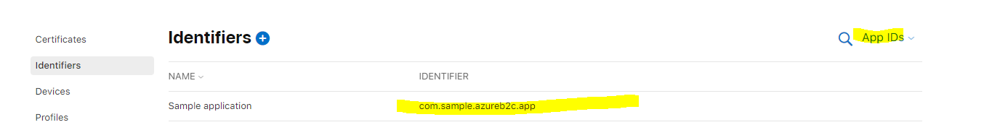

3. Create Service ID, associate the App ID to this new Service ID. You should provide:
   1. the domain of the Azure AD B2C, `<b2c-account>.b2clogin.com`
   2. the reply url to the Azure AD B2C policy. It should look like: `https://<b2c-account>.b2clogin.com/<tenant-id-guid>/oauth2/authresp`

      

4. Add Azure AD B2C details to Service ID, define a new identifier based on guidance, this identifier will be used in Azure AD B2C configuration later on.

      

5. Copy the Team ID, as you will use this to create Apple token to connect to the Apple authorization services.

      

6. Create new client_secret for Apple ID, You will need to go to `Certificates, Identifiers, and Profiles` > `Keys`, create new Key and select Sign in with Apple. Then you must go to `Configure`, You will select the original App Identifier which was created on step 1.

      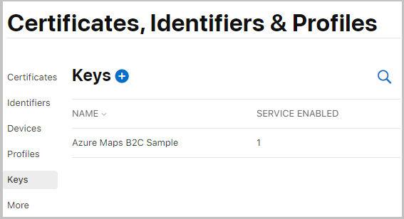

      

      Finally, you can download the P8 file from Apple. Store this in a secure location and extract out the private key text by using a text editor. Remove any line-breaks and place into the sample code below which creates a token to be used as the client_secret for Azure AD B2C.

7. Use the following code to create a token With the privateKey (no line breaks), the team ID, and the service ID. The output token will be used for OpenID connect configuration.
      A simple implementation can be referenced from the following blog, [Implementing Sign In with Apple in AspNetCore](https://www.scottbrady91.com/OpenID-Connect/Implementing-Sign-In-with-Apple-in-ASPNET-Core). See [Apple developer guidance](https://developer.apple.com/documentation/sign_in_with_apple/generate_and_validate_tokens#326204) for reference.

      > [!IMPORTANT]
      > The follow token created can have a maximum lifetime of 6 months from the day it was created. Plan to renew this token prior to expiry for production applications. You will need NuGet Package `System.IdentityModel.Tokens.Jwt` as a dependency.

      ```C#
      using Microsoft.IdentityModel.Tokens;
      using System;
      using System.Collections.Generic;
      using System.IdentityModel.Tokens.Jwt;
      using System.Security.Claims;
      using System.Security.Cryptography;

      namespace JwtCreator
      {
         class Program
         {
            static void Main(string[] args)
            {
                  // remove all line breaks from the p8 file from Apple
                  // this secret is good for 6 months. Before expiration run and upload new secret to Azure AD B2C.
                  const string privateKey = "MIGTAg.....iz3OLycVg";
                  string token = CreateSignedJwt(privateKey, "8UU7AZPUQF", "com.sample.azureb2c");
                  Console.WriteLine(token);
                  Console.ReadKey();
            }

            private static string CreateSignedJwt(string privateKey, string teamId, string serviceId)
            {
                  var cngKey = CngKey.Import(
                  Convert.FromBase64String(privateKey),
                  CngKeyBlobFormat.Pkcs8PrivateBlob);
                  ECDsa eCDsa = new ECDsaCng(cngKey);

                  var now = DateTime.UtcNow;
                  var tokenHandler = new JwtSecurityTokenHandler();

                  var jwtToken = tokenHandler.CreateJwtSecurityToken(
                     issuer: teamId,
                     audience: "https://appleid.apple.com",
                     subject: new ClaimsIdentity(new List<Claim>() { new Claim("sub", serviceId) }),
                     notBefore: now,
                     expires: now.AddDays(180),
                     issuedAt: now,
                     signingCredentials: new SigningCredentials(
                        new ECDsaSecurityKey(eCDsa), SecurityAlgorithms.EcdsaSha256));

                  return tokenHandler.WriteToken(jwtToken);
            }
         }
      }
      ```

8. Create the identity provider in the Azure AD B2C tenant. There 2 options depending on the level of customization required.

   1. Using a built in policy.

      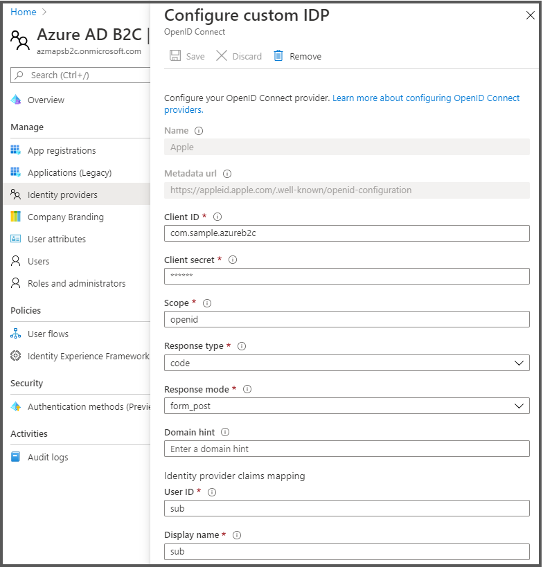

      Provide, Apple Service ID as the Client ID, Generated token as the Client Secret, and specify `openid` for Scope, `code` for Response type, `form_post` for Response mode, User ID claim mapping to `sub`, and Display name claim mapping to `sub` too.

   2. (Advanced Customizations) Using the Identity Experience Framework. Prerequisite is to [enable the Azure AD B2C custom policies starter pack](https://docs.microsoft.com/azure/active-directory-b2c/custom-policy-get-started) for custom policies.

      `TrustFrameworkBase.xml`

      ```xml
         <ClaimsProvider>
            <Domain>apple.com</Domain>
            <DisplayName>Sign in with Apple</DisplayName>
            <TechnicalProfiles>
               <TechnicalProfile Id="Apple-OAUTH">
                  <DisplayName>Apple</DisplayName>
                  <Protocol Name="OpenIdConnect" />
                  <Metadata>
                     <Item Key="ProviderName">apple</Item>
                     <Item Key="response_types">code</Item>
                     <Item Key="response_mode">form_post</Item>
                     <Item Key="issuer">https://appleid.apple.com</Item>
                     <Item Key="METADATA">https://appleid.apple.com/.well-known/openid-configuration</Item>
                     <Item Key="authorization_endpoint">https://appleid.apple.com/auth/authorize</Item>
                     <Item Key="AccessTokenEndpoint">https://appleid.apple.com/auth/token</Item>
                     <Item Key="scope">openid</Item>
                     <Item Key="HttpBinding">POST</Item>
                     <Item Key="UsePolicyInRedirectUri">0</Item>
                     <Item Key="client_id">com.sample.azureb2c</Item> <!-- This is the Apple Service ID  -->
                  </Metadata>
                  <CryptographicKeys>
                     <Key Id="client_secret" StorageReferenceId="B2C_1A_AppleToken" />
                  </CryptographicKeys>
                  <OutputClaims>
                     <OutputClaim ClaimTypeReferenceId="identityProvider" DefaultValue="appleid.apple.com" />
                     <OutputClaim ClaimTypeReferenceId="issuerUserId" PartnerClaimType="sub" />
                     <OutputClaim ClaimTypeReferenceId="email" PartnerClaimType="email" />
                     <OutputClaim ClaimTypeReferenceId="displayName" PartnerClaimType="name" />
                     <OutputClaim ClaimTypeReferenceId="objectId" PartnerClaimType="oid" />
                     <OutputClaim ClaimTypeReferenceId="authenticationSource" DefaultValue="socialIdpAuthentication" />
                  </OutputClaims>
                  <OutputClaimsTransformations>
                     <OutputClaimsTransformation ReferenceId="CreateRandomUPNUserName" />
                     <OutputClaimsTransformation ReferenceId="CreateUserPrincipalName" />
                     <OutputClaimsTransformation ReferenceId="CreateAlternativeSecurityId" />
                  </OutputClaimsTransformations>
                  <UseTechnicalProfileForSessionManagement ReferenceId="SM-SocialLogin" />
               </TechnicalProfile>
            </TechnicalProfiles>
         </ClaimsProvider>
      ```

   Once the Claims Provider for Apple has been created, you must added the claim exchange into the `TrustFrameworkExtensions.xml` user journeys. This file can be very large so to keep it brief, a snippet can be found to show where the Technical profile will be referenced.

    `TrustFrameworkExtensions.xml`

   ```xml
   <UserJourney Id="SignUpSignInSocial">
         <OrchestrationSteps>
         <OrchestrationStep Order="1" Type="CombinedSignInAndSignUp" ContentDefinitionReferenceId="api.signuporsignin">
            <ClaimsProviderSelections>
               <ClaimsProviderSelection TargetClaimsExchangeId="AmazonExchange" />
               <ClaimsProviderSelection TargetClaimsExchangeId="GoogleExchange" />
               <ClaimsProviderSelection TargetClaimsExchangeId="FacebookExchange" />
               <ClaimsProviderSelection TargetClaimsExchangeId="AppleExchange" />  <!-- Define the exchange ID -->
               <ClaimsProviderSelection ValidationClaimsExchangeId="LocalAccountSigninEmailExchange" />
            </ClaimsProviderSelections>
            <ClaimsExchanges>
               <ClaimsExchange Id="LocalAccountSigninEmailExchange" TechnicalProfileReferenceId="SelfAsserted-LocalAccountSignin-Email" />
            </ClaimsExchanges>
         </OrchestrationStep>

         <!-- Check if the user has selected to sign in using one of the social providers -->
         <OrchestrationStep Order="2" Type="ClaimsExchange">
            <Preconditions>
               <Precondition Type="ClaimsExist" ExecuteActionsIf="true">
               <Value>objectId</Value>
               <Action>SkipThisOrchestrationStep</Action>
               </Precondition>
            </Preconditions>
            <ClaimsExchanges>
               <ClaimsExchange Id="AmazonExchange" TechnicalProfileReferenceId="Amazon-OAUTH" />
               <ClaimsExchange Id="GoogleExchange" TechnicalProfileReferenceId="Google-OAUTH" />
               <ClaimsExchange Id="FacebookExchange" TechnicalProfileReferenceId="Facebook-OAUTH" />
               <ClaimsExchange Id="AppleExchange" TechnicalProfileReferenceId="Apple-OAUTH" />   <!-- Reference the technical profile -->
               <ClaimsExchange Id="SignUpWithLogonEmailExchange" TechnicalProfileReferenceId="LocalAccountSignUpWithLogonEmail" />
            </ClaimsExchanges>
         </OrchestrationStep>

         <!-- Omitted other steps -->
   ```

> [!IMPORTANT]
> Reference any Apple Design Guides to support the app approval process. This may require styling and display text changes. See [StackOverflow post](https://stackoverflow.com/questions/60422475/sign-in-with-apple-button-customization) and [Apple Human Interface Guidelines](https://developer.apple.com/design/human-interface-guidelines/sign-in-with-apple/overview/buttons/) for more details.
